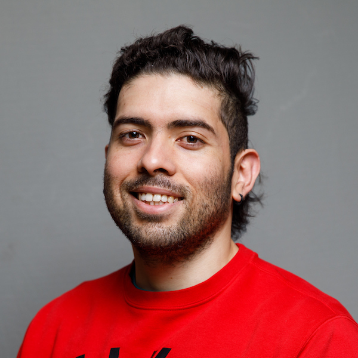

```{r, include=FALSE}
knitr::opts_chunk$set(
  results='asis', 
  echo = FALSE
)


library(glue)
library(pagedown)
library(readr)
library(tidyverse)
library(magrittr) # For the pipe
#source("cv_printing_functions.r")

# Read in all data and initialize a CV printer object
#CV <- create_CV_object(
#  data_location = "/Library/Frameworks/R.framework/Versions/4.0/Resources/library/datadrivencv/sample_data",  
#  pdf_mode = params$pdf_mode
#)

# Set this to true to have links turned into footnotes at the end of the document
PDF_EXPORT <- FALSE


# Holds all the links that were inserted for placement at the end
links <- c()
source('parsing_functions.R')


# Load csv with position info
position_data <- read_csv("positions.csv", show_col_types = FALSE)


```


```{r}
# When in pdf export mode the little dots are unaligned, so fix that with some conditional CSS.
#if(params$pdf_mode) {
#    cat("
#<style>
#:root{
#  --decorator-outer-offset-left: -6.5px;
#}
#</style>")
#}

# When in export mode the little dots are unaligned, so fix that. 
if(PDF_EXPORT){
  cat("
  <style>
  :root{
    --decorator-outer-offset-left: -6.5px;
  }
  </style>")
}

```

```{css, echo=FALSE}

.pagedjs_page:not(:first-of-type) {
  --sidebar-width: 0rem;
  --sidebar-background-color: #ffffff;
  --main-width: calc(var(--content-width) - var(--sidebar-width));
  --decorator-horizontal-margin: 0.2in;
}

```


Aside
================================================================================


{width=85%}


```{r}

# Build interactive network of positions colored by section
# and connected if they occurred in the same year
#datadrivencv::build_network_logo(CV$entries_data)
```


```{r}
#if(params$pdf_mode){
#  cat("View this CV online with links at _nickstrayer.me/datadrivencv/_")
#} else {
#  cat("[<i class='fas fa-download'></i> Download a PDF of this CV](https://github.com/nstrayer/cv/raw/master/strayer_cv.pdf)")
#}
```

Contact {#contact}
--------------------------------------------------------------------------------

- <i class="fa fa-envelope"></i> dpadil10@asu.edu
- <i class="fa fa-link"></i> [dylanpadilla.netlify.app](http://dylanpadilla.netlify.app/)
- <i class="fa fa-github"></i> [github.com/Dylan-Padilla](https://github.com/Dylan-Padilla)
- <i class="fa fa-twitter"></i> [Dylan\_Padilla94](https://twitter.com/Dylan_Padilla94?ref_src=twsrc%5Etfw)
- <i class="fa fa-phone"></i> +1 (480) 646-7769


```{r}
#CV %>% print_contact_info()
```


Skills {#skills}
--------------------------------------------------------------------------------

- <i class="fa fa-laptop"></i> **Programming**: R, CSS, HTML, GitHub
- <i class="fa fa-flask"></i> **Laboratory**: Experimental evolution
- <i class="fa fa-lightbulb-o"></i> **Other**: Science teaching, science writing, data analysis, data visualization, statistics, experimental design

```{r}
#CV %>% print_skill_bars()
```

Disclaimer {#disclaimer}
--------------------------------------------------------------------------------

Made with the R package [**pagedown**](https://github.com/rstudio/pagedown). 

The source code is available [on github.com/Dylan-Padilla/cv](https://github.com/Dylan-Padilla/pagedown-cv).

Last updated on `r Sys.Date()`.


Main
================================================================================

Dylan Padilla {#title}
--------------------------------------------------------------------------------

<p align="justify">
I am an Evolutionary Biology PhD candidate at the School of Life Sciences, [Arizona State University](https://www.asu.edu/). My research examines the evolution of the life history among vertebrates and invertebrates (e.g., [see here](https://www.dropbox.com/s/9umvsjpvn7mj2eb/Padilla%20Perez%20D.J.%20and%20Angilletta%20Jr.%2C%20M.J.%20%282022%29.%20Macroclimatic%20and%20maternal%20effects%20on%20the%20evolution%20of%20reproductive%20traits%20in%20lizards.pdf?dl=0)). In doing so, I use phylogenetic comparative methods to generate hypotheses and draw broad conclusions that can be applied to wide ranges of taxa (e.g., [see here](https://www.dropbox.com/s/uuzlu4m8valyw97/Padilla%20Perez%20et%20al.%2C%202022.%20The%20correlated%20evolution%20of%20foraging%20mode%20and%20reproductive%20effort%20in%20lizards.pdf?dl=0)). In addition, I conduct experimental evolution studies to examine the frequency of alleles with underlying effects on the foraging behavior of individuals evolving under different selective pressures, which enables me to make strong inferences concerning phenotypic and genetic responses to selection (e.g., [see here](https://academic.oup.com/jeb/article/37/2/201/7485763?login=true)).
</p>

```{r}
# Note the special double pipe so we modify the CV object in place
#CV %<>% print_text_block("intro")

```


Education {data-icon=graduation-cap data-concise=true}
--------------------------------------------------------------------------------

```{r}

#CV %<>% print_section('education')
print_section(position_data, "education")

```


Jobs and Research Experience {data-icon=laptop}
--------------------------------------------------------------------------------

```{r}
#CV %<>% print_section('research_positions')

print_section(position_data, 'research_positions')

```

Peer-reviewed Publications {data-icon=book}
--------------------------------------------------------------------------------

```{r}
#CV %<>% print_section('research_positions')

print_section(position_data, 'academic_articles')

```

GRANTS AND AWARDS {data-icon=award}
--------------------------------------------------------------------------------

```{r}
#CV %<>% print_section('academic_articles')
print_section(position_data, 'data_grant')
```

Member of committee and Mentoring {data-icon=chalkboard-teacher}
--------------------------------------------------------------------------------

```{r}
#CV %<>% print_text_block('teaching_experience_aside')

print_section(position_data, 'data_com')

```


RECENT TALKS, INVITED TALKS, WORKSHOPS ATTENDED {data-icon=users}
--------------------------------------------------------------------------------


```{r}
#CV %<>% print_text_block('teaching_experience_aside')

#print_section(position_data, 'teaching_positions')

print_section(position_data, 'data_talks')

```


Service and Society member {data-icon=handshake}
--------------------------------------------------------------------------------


```{r}
#CV %<>% print_text_block('teaching_experience_aside')

#print_section(position_data, 'teaching_positions')

print_section(position_data, 'data_mem')

```


Reviewer {data-icon=pencil}
--------------------------------------------------------------------------------


```{r}
#CV %<>% print_text_block('teaching_experience_aside')

#print_section(position_data, 'teaching_positions')

print_section(position_data, 'data_rev')

```


Languages {data-icon=commenting}
--------------------------------------------------------------------------------

```{r}

print_section(position_data, 'data_lang')

```


```{r}

#CV %<>% print_text_block('teaching_experience_aside')


```


```{r}
#CV %<>% print_links()
```
