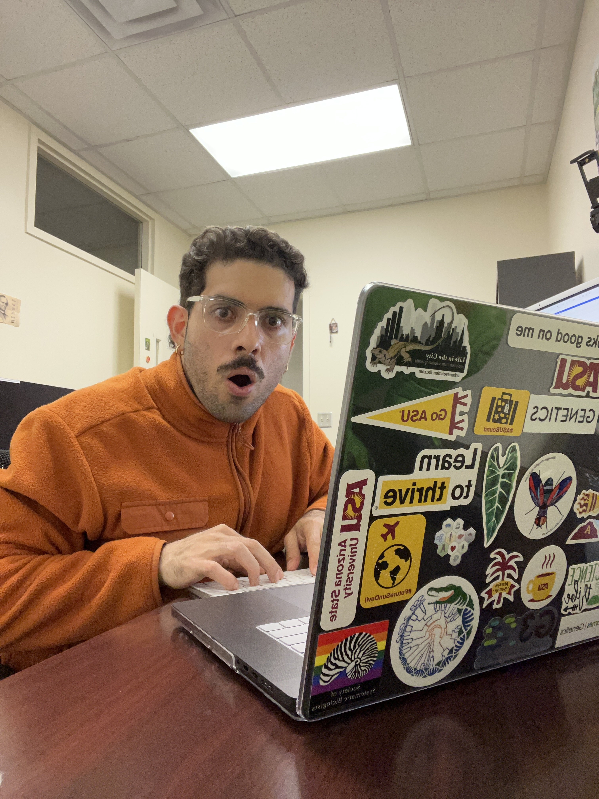

```{r, include=FALSE}
knitr::opts_chunk$set(
  results='asis', 
  echo = FALSE
)

library(magrittr) # For the pipe
source("cv_printing_functions.r")

# Read in all data and initialize a CV printer object
CV <- create_CV_object(
  data_location = "/Users/dpadil10/ASU Dropbox/Dylan Padilla/CV/pagedown-cv/",  
  pdf_mode = params$pdf_mode
)

```

```{css, echo=FALSE}

.pagedjs_page:not(:first-of-type) {
  --sidebar-width: 0rem;
  --sidebar-background-color: #ffffff;
  --main-width: calc(var(--content-width) - var(--sidebar-width));
  --decorator-horizontal-margin: 0.2in;
}

```


```{r}
# When in pdf export mode the little dots are unaligned, so fix that with some conditional CSS.
if(params$pdf_mode) {
    cat("
<style>
:root{
  --decorator-outer-offset-left: -6.5px;
}
</style>")
}
```


Aside
================================================================================

```{r}
# Build interactive network of positions colored by section
# and connected if they occurred in the same year
##datadrivencv::build_network_logo(CV$entries_data)




```


Contact {#contact}
--------------------------------------------------------------------------------

```{r}
CV %>% print_contact_info()
```


Language Skills {#skills}
--------------------------------------------------------------------------------

```{r}
CV %>% print_skill_bars()
```


Disclaimer {#disclaimer}
--------------------------------------------------------------------------------

Made with the R package [**pagedown**](https://github.com/rstudio/pagedown). 

The source code is available [on github.com/Dylan-Padilla/pagedown-cv](https://github.com/Dylan-Padilla/pagedown-cv).

Last updated on `r Sys.Date()`.


Main
================================================================================

Dylan Padilla {#title}
--------------------------------------------------------------------------------

<p align="justify">
I am a G. Evelyn Hutchinson Postdoctoral Associate at [Yale University](https://yibs.yale.edu/hutchinson-fellows). My research focuses on the interplay between evolutionary genomics and ecology to identify the processes that give rise to high diversification rates across the tree of life. In doing so, I use population genetic models and phylogenetic comparative methods to generate hypotheses and draw broad conclusions that can be applied to wide ranges of taxa (e.g., [see here](https://doi.org/10.32942/X26D3R)).<br><br>
Also, I enjoy coding and developing new programming tools to solve specific problems in the field of evolutionary biology; check my latest programming project [here](https://www.youtube.com/@asnamnat9152/shorts).
</p>

```{r}
# Note the special double pipe so we modify the CV object in place
#CV %<>% print_text_block("intro") 
```


Education {data-icon=graduation-cap data-concise=true}
--------------------------------------------------------------------------------

```{r}
CV %<>% print_section('education')
```


Jobs and Research Experience {data-icon=laptop}
--------------------------------------------------------------------------------

```{r}
CV %<>% print_section('research_positions')
```

Peer-reviewed Publications {data-icon=book}
--------------------------------------------------------------------------------

```{r}

CV %<>% print_section('academic_articles')

```


Teaching experience {data-icon=chalkboard-teacher}
--------------------------------------------------------------------------------

```{r}

CV %<>% print_section('teaching')

```

GRANTS AND AWARDS {data-icon=award}
--------------------------------------------------------------------------------

```{r}
CV %<>% print_section('data_grant')
```

Member of committee and Mentoring {data-icon=book-reader}
--------------------------------------------------------------------------------


```{r}

CV %<>% print_section('data_com')

```


RECENT TALKS, INVITED TALKS, WORKSHOPS ATTENDED {data-icon=users}
--------------------------------------------------------------------------------


```{r}

CV %<>% print_section('data_talks')
```

Service and Society member {data-icon=handshake}
--------------------------------------------------------------------------------


```{r}

CV %<>% print_section('data_mem')
```

Reviewer {data-icon=pencil}
--------------------------------------------------------------------------------


```{r}

CV %<>% print_section('data_rev')

```

Languages {data-icon=commenting}
--------------------------------------------------------------------------------


```{r}

CV %<>% print_section('data_lang')
```
